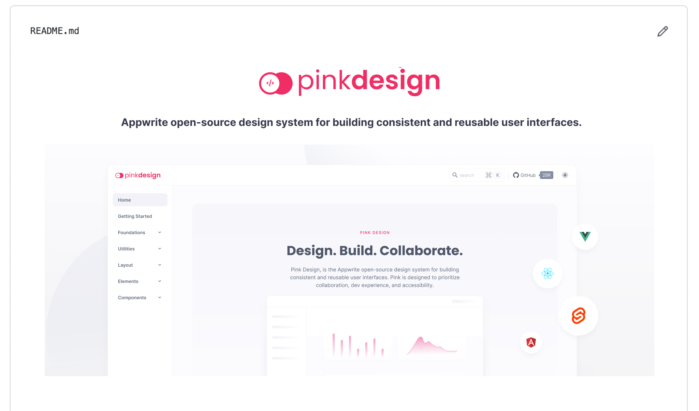

 

    
     
     
    <b>Appwrite's open-source design system for building consistent and reusable user interfaces.</b>
     
     
    

Pink Design has been built with [Asto](https://astro.build/)

## Contributing

All code contributions - including those of people having commit access - must go through a pull request and be approved by a core developer before being merged. This is to ensure a proper review of all the code.

We truly ❤️ pull requests! If you wish to help, you can learn more about how you can contribute to this project in the [contribution guide](CONTRIBUTING.md).

## Security

For security issues, kindly email us at [security@appwrite.io](mailto:security@appwrite.io) instead of posting a public issue on GitHub.

## Follow Us

Join our growing community around the world! See our official [Blog](https://medium.com/appwrite-io). Follow us on [Twitter](https://twitter.com/appwrite), [Facebook Page](https://www.facebook.com/appwrite.io), [Facebook Group](https://www.facebook.com/groups/appwrite.developers/), [Dev Community](https://dev.to/appwrite) or join our live [Discord server](https://appwrite.io/discord) for more help, ideas, and discussions.

## License

This repository is available under the [MIT](./LICENSE).
