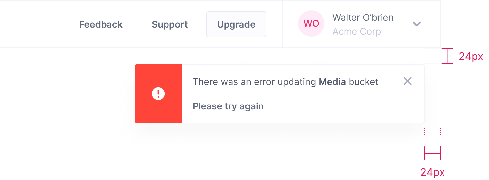

# Alert (Sticky)
Alerts display both task-generated and system-generated messages and persist until they are dismissed by the user. All alerts should use a color that corresponds with their message intent and can also be accompanied by an icon to reinforce the message intent.  

Alerts should contain at minimum a description to give the user enough information to help them understand the purpose of the alert and what needs to be done, if anything.  


### Placement
In the console, Sticky Alerts should appear below the main (top) navigation bar with 24px in padding.  


 


## Alert - Sticky (default color)

```html
<section class="alert-sticky">
    <div class="alert-sticky-image">
        <span class="icon-info" aria-hidden="true"></span>
    </div>
    <div class="alert-sticky-content">
        <h4 class="alert-sticky-title">Alert Sticky Title</h4>
        <p>Provide contextual feedback messages for typical user actions.</p>
    </div>
    <div class="buttons u-flex">
        <button class="button is-text is-small">
            <span class="text">Action 1</span>
        </button>
        <button class="button is-text is-small">
            <span class="text">Action 2</span>
        </button>
    </div>
</section>
```

## Alert - is-info
```html
<section class="alert-sticky is-info">
    <div class="alert-sticky-image">
        <span class="icon-info" aria-hidden="true"></span>
    </div>
    <div class="alert-sticky-content">
        <h4 class="alert-sticky-title">Alert Sticky Title</h4>
        <p>Provide contextual feedback messages for typical user actions.</p>
    </div>
    <div class="buttons u-flex">
        <button class="button is-text is-small">
            <span class="text">Action 1</span>
        </button>
        <button class="button is-text is-small">
            <span class="text">Action 2</span>
        </button>
    </div>
</section>
```

## Alert - is-success
```html
<section class="alert-sticky is-success">
    <div class="alert-sticky-image">
        <span class="icon-info" aria-hidden="true"></span>
    </div>
    <div class="alert-sticky-content">
        <h4 class="alert-sticky-title">Alert Sticky Title</h4>
        <p>Provide contextual feedback messages for typical user actions.</p>
    </div>
    <div class="buttons u-flex">
        <button class="button is-text is-small">
            <span class="text">Action 1</span>
        </button>
        <button class="button is-text is-small">
            <span class="text">Action 2</span>
        </button>
    </div>
</section>
```

## Alert - is-warning
```html
<section class="alert-sticky is-warning">
    <div class="alert-sticky-image">
        <span class="icon-info" aria-hidden="true"></span>
    </div>
    <div class="alert-sticky-content">
        <h4 class="alert-sticky-title">Alert Sticky Title</h4>
        <p>Provide contextual feedback messages for typical user actions.</p>
    </div>
    <div class="buttons u-flex">
        <button class="button is-text is-small">
            <span class="text">Action 1</span>
        </button>
        <button class="button is-text is-small">
            <span class="text">Action 2</span>
        </button>
    </div>
</section>
```

## Alert - is-danger
```html
<section class="alert-sticky is-danger">
    <div class="alert-sticky-image">
        <span class="icon-info" aria-hidden="true"></span>
    </div>
    <div class="alert-sticky-content">
        <h4 class="alert-sticky-title">Alert Sticky Title</h4>
        <p>Provide contextual feedback messages for typical user actions.</p>
    </div>
    <div class="buttons u-flex">
        <button class="button is-text is-small">
            <span class="text">Action 1</span>
        </button>
        <button class="button is-text is-small">
            <span class="text">Action 2</span>
        </button>
    </div>
</section>
```