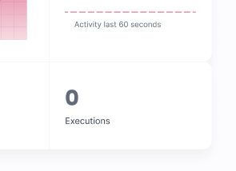

# Border Radius
Different sizes of corner radius are used throughout the Appwrite UI according to the component size. Keep in mind that small components will have smaller radius then bigger components.

### Scale
All corners for components is done in multiples of 4 pixels.

### Variables
CSS Variables Names:
--border-radius-xsmall = 4px
--border-radius-small = 8px
--border-radius-medium = 16px
--border-radius-circular = 50%

## border-radius-xsmall
Use a border of 4px to soften the corners of small components and maintain balance between the shape and the border radius.
**The smaller size works well for small UI elements like checkboxes, input fields, buttons, alerts and tooltips.**

```html
<style>
    .card { width: 200px; aspect-ratio: 1 / 1; }
</style>
<div class="card" style="border-radius: var(--border-radius-xsmall)"></div>
```

## border-radius-small
Use a border of 8px to soften the corners of small components that are part of a bigger one or for medium components. 
**The medium size works well for items in the sidebar menu and for popovers.**
```html
<div class="card" style="border-radius: var(--border-radius-small)"></div>
```

## border-radius-medium
Use a border of 16px when a UI element is larger or needs to float above the underlying UI. 
**The larger size works well for big UI elements like cards, modals and tables.**
```html
<div class="card" style="border-radius: var(--border-radius-medium)"></div>
```

## border-radius-circular
Use circular border only on a specific elements that needs to be rounded. 
**The circular radius works well for UI elements like icon buttons, avatars, tags and switches.**
```html
<div class="card" style="border-radius: var(--border-radius-circular)"></div>
```

## Examples
All corners for components is done in multiples of 4 pixels.

**DO**
Use large corner radius for big surface.

 


**DON'T**
Use small corner radius for big surface, it will make it look really sharp and serious.


